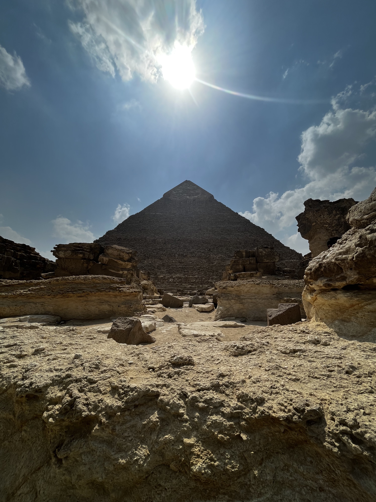
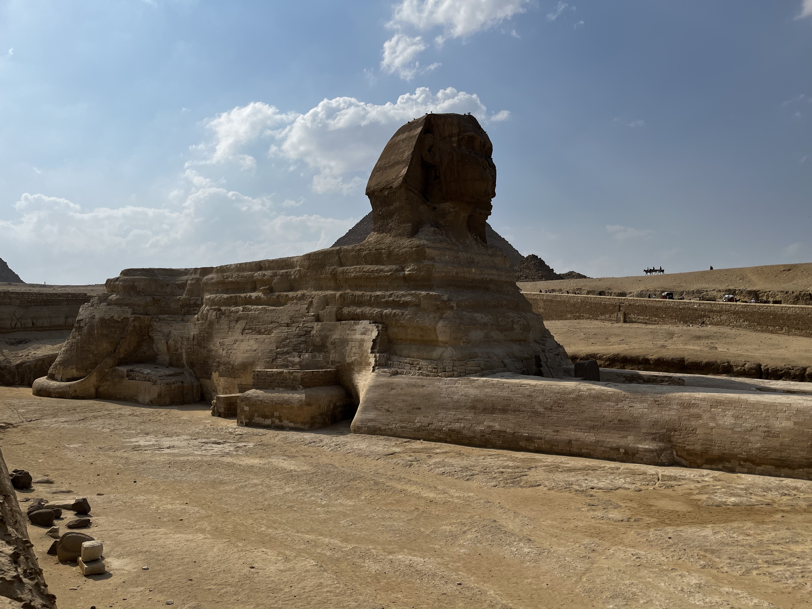
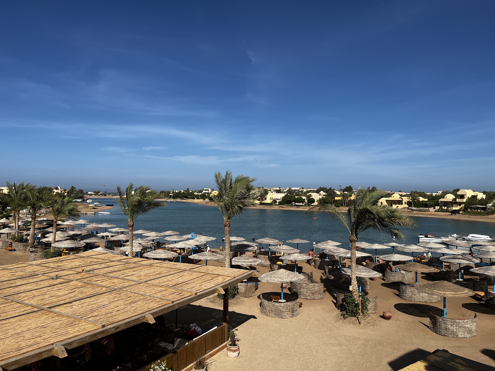

# egypt travel guide
A guide to traveling in Egypt; where to go, what to eat, how to get around, etc.
## essential travel spots
- [National Museum of Egyptian Civilization](https://nmec.gov.eg/)
  - Here you can learn all about Egyptian culture through the years; from the Islamic takeover is 639 AD, to the dynastic rule (where you can see the actual mummies of the pharaohs!).
  
- The Great Pyramids of Giza and the Sphinx
  - This is an obvious one but the pyramids and the sphinx are truly a sight to see! You can even ride on camels and go inside one of the pyramids (although going iside is pretty underwhelming).  
 
- City of El Gouna: [The Three Corners Rihana Resort](https://hotels.elgouna.com/hotel/the-three-corners-rihana-resort/)
  - The city of El Gouna is right on the coast of the Red Sea. The Rihana Resort is all-inclusive with a breakfast, lunch, and dinner buffet. You can also take a shuttle out to the Red Sea to snorkel. 
 
- City of Marina El Alamein - North Coast
  - This city is right on the coast of the Mediterranean Sea. It is probably one of the most beautiful places in Egypt. There are beaches, restuarants, and you can rent jet skis and boats to go out to the beautfiul sea. 
  
- City of Alexandria
  - The busy streets and tall skyscrapers make Alexandria one of the more modern cities in Egypt. There are great restaurants, shops in the streets, and lots of activities. You can go to the beach, visit the Lighthouse of Alexandria, and go to many different museums.
 
- Khan el Khalili
  - This famous bazaar is probably what you think of when you think of the streets of Egypt. Venders selling spices, trinkets, and cloth line the streets. You definitely want to not bring anything too valuable as pickpocketing is common in this busy area. It would also be a good idea to get a local guide who can bargain for you. But overall, this is a great place to get souvenirs and traditional Egyptian clothes. 
- Mokattam Mountain 
  - This is a famous mountain in Egypt that was carved to be made into a church. A miracle of moving the mountain was said to happen here, so they decided to carve a huge church into the mountainside.
 
 
 
- Coptic Churches
  - Many people do not know about the many beautiful Coptic Churches in Egypt but there are so many that it's hard to pick just a few. Some famous ones include the Saint Mary's Church in Maadi, the new Cathedral of the Nativity of Christ, and the Saint Pishoy Monastery.  

## restaurants
- Abou Tarek 
  - Koshary is Egypt's national dish and Abou Tarek arguably serves the best koshary. Koshary is made with chickpeas, lentils, pasta, and rice topped with a spicy tomato sauce, garlic oil, and fried onions. It is mostly sold in small carts, and the original owner's koshary cart got so popular it was made into a restaurant. 
 
- 9 Pyramids Lounge
  - This restaurant with a great view of the pyramids also serves great breakfast. The two options are either the Continental Breakfast or the Egyptian Breakfast, but they both come with so much food. You can also get a variety of fresh juices, appetizers, and soups. 
 
- Balbaa
  - This family style restaurant serves traditional shawarma, beef and chicken kababs, and a variety of sauces and dips, along with traditional Egyptian-style pita bread (baladi). 
- Saber
  - 'Roz bel laban' or rice with milk is a sweet dessert that Saber is known for, along with it's original toppings of mestika (special type of pistachio) ice cream and walnuts.  

## other tips
- Bring your own toilet paper, hand sanitizer, and a small bag for trash
  - In most restrooms, they charge you for toilet paper; either that or the workers are expecting a tip. You also will want to bring hand sanitizers or wipes and a separate bag for trash because it can be dirty in some places.
- Know the price of something (from locals or research) before buying something. For example if you know the price of a bottle of water, instead of asking for how much it is, give the vender the amount of money and ask for a bottle of water (they will rack up prices for tourists).
- A lot of the food in Egypt (especially fresh fruits/vegetables) can cause stomach problems, so taking a stomach medicine before each meal really helps (ex. pepto bismol). 
- If you can find someone, it is very useful to have a local Egyptian as a guide, or at least knows the city enough to take you to all the best places, hook you up with the best tour guides, find the best restaurants, bargain for you, etc. 

# enjoy your trip!
