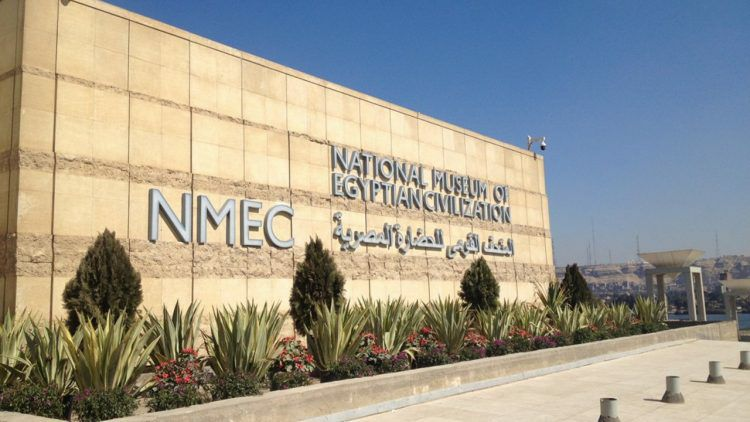

# egypt travel guide
A guide to traveling in Egypt; where to go, what to eat, how to get around, etc. Listed are pictures and links for each item
## essential travel spots
- National Museum of Egyptian Civilization
  - Here you can learn all about Egyptian culture through the years; from the Islamic takeover is 639 AD, to the dynastic rule (where you can see the actual mummies of the pharaohs!).
 	
- The Great Pyramids of Giza and the Sphinx
  - This is an obvious one but the pyramids and the sphinx are truly a sight to see! You can even ride on camels and go inside one of the pyramids (although it is underwhelming). 
- City of El Gouna: [The Three Corners Rihana Resort](https://hotels.elgouna.com/hotel/the-three-corners-rihana-resort/)
  - The city of El Gouna is right on the coast of the Red Sea. The resort is all-inclusive with a breakfast, lunch, and dinner buffet. You can also take a shuttle out to the Red Sea to snorkel. 
- City of Marina El Alamein - North Coast
  
